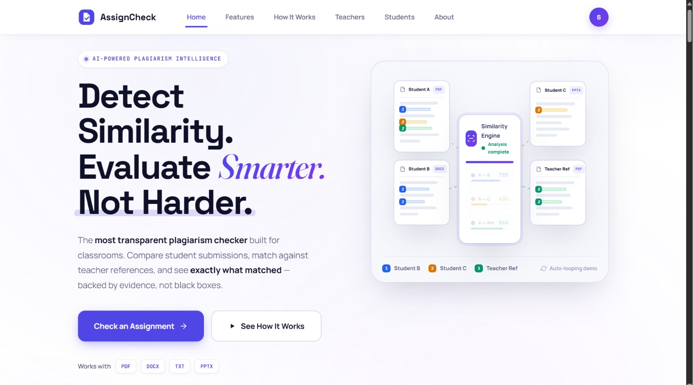
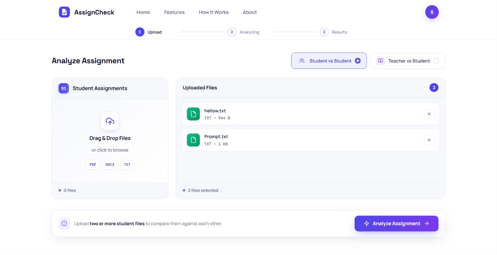
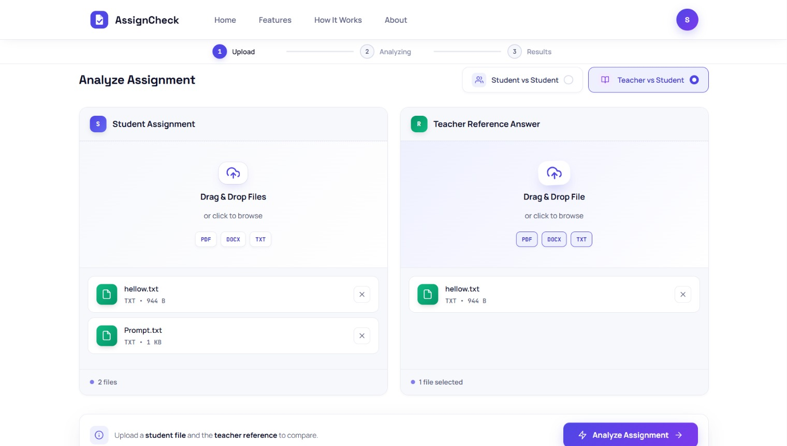
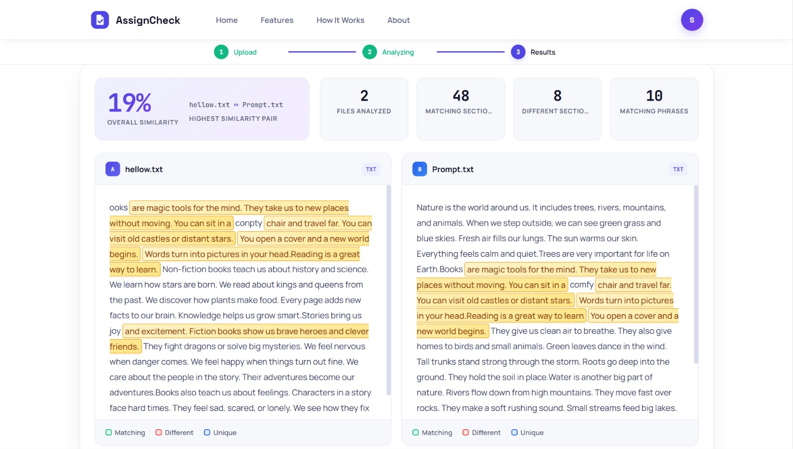
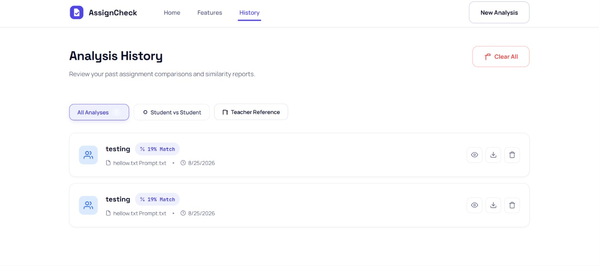
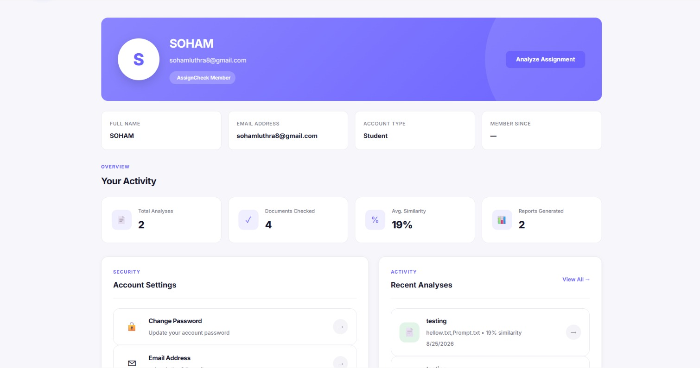

# AssignCheck

> **Detect Similarity. Evaluate Smarter. Not Harder.**

AssignCheck is a web-based assignment similarity and plagiarism detection system designed to help students and teachers compare assignments, identify matching content, and generate detailed similarity reports.

---

# 📸 Application Preview

## 🏠 Home Page

The landing page introduces AssignCheck and provides access to assignment analysis.

![Home Page](Assets/Screenshots/home.jpeg
# AssignCheck

> **Detect Similarity. Evaluate Smarter. Not Harder.**

AssignCheck is a web-based assignment similarity and plagiarism detection system designed to help students and teachers compare assignments, identify matching content, and generate detailed similarity reports.

---

# 📸 Application Preview

## 🏠 Home Page

The landing page introduces AssignCheck and provides access to assignment analysis.



---

## 📄 Student vs Student Analysis

Compare multiple student assignments and detect matching content between submissions.



---

## 👨‍🏫 Teacher vs Student Analysis

Compare a student's assignment against a teacher/reference answer.



---

## 📊 Similarity Results

View similarity percentage, matching sections, statistics, and detailed comparison results.



---

## 📚 Analysis History

Access previous analyses, reports, and similarity records.



---

## 👤 User Profile Dashboard

Track activity, generated reports, average similarity, and account information.



---

# ✨ Features

- 📄 Upload assignment files
- 🔍 Student vs Student comparison
- 👨‍🏫 Teacher vs Student comparison
- 📊 Similarity percentage calculation
- 🟨 Matching content highlighting
- 📑 Detailed similarity reports
- 📚 Analysis history
- 👤 User profile dashboard
- 💾 Saved reports
- 📈 Statistics and analytics
- 📂 PDF, DOCX and TXT support
- 🔐 User-specific data management
- 🖥️ Responsive user interface

---

# 🛠️ Technologies Used

## Frontend

- HTML5
- CSS3
- JavaScript (ES6+)

## Backend

- JavaScript
- JSON Server
- REST API

## Development Tools

- Visual Studio Code
- Git
- GitHub
- Live Server

---

# 📂 Project Structure

```text
Assignment-Plagiarism/
│
├── src/
│   ├── Backend/
│   │   ├── CheckBackend.js
│   │   └── HomeBackend.js
│   │
│   └── Frontend/
│       ├── Templates/
│       ├── Scripts/
│       ├── CSS/
│       └── Assets/
│
├── assets/
│   └── screenshots/
│       ├── home.png
│       ├── student-vs-student.png
│       ├── teacher-vs-student.png
│       ├── results.png
│       ├── history.png
│       └── profile.png
│
├── db.json
├── README.md
└── package.json
```

---

# ⚙️ Prerequisites

Before running AssignCheck, install:

### Node.js

Download:

https://nodejs.org

Verify installation:

```bash
node --version
npm --version
```

### Visual Studio Code

Download and install VS Code.

### Live Server Extension

Install the Live Server extension from VS Code Marketplace.

---

# 🚀 Installation

## Step 1 — Clone Repository

```bash
git clone https://github.com/soham300/Assignment-Plagiarism.git
```

Move into the project folder:

```bash
cd Assignment-Plagiarism
```

---

## Step 2 — Install JSON Server

```bash
npm install -g json-server
```

Verify:

```bash
json-server --version
```

---

## Step 3 — Start Backend

```bash
json-server --watch db.json --port 3000
```

Backend URL:

```text
http://localhost:3000
```

---

## Step 4 — Verify Backend

Open:

```text
http://localhost:3000/users
http://localhost:3000/filedata
http://localhost:3000/fileresult
http://localhost:3000/assignments
```

---

## Step 5 — Start Frontend

Open:

```text
src/Frontend/Templates/index.html
```

Right click and select:

```text
Open with Live Server
```

---

# 🧭 How to Use AssignCheck

## 🏠 Step 1 — Open the Home Page

After launching the application, the AssignCheck home page appears.

Click:

**Check an Assignment**

---

## 📤 Step 2 — Select Analysis Type

Choose one of the following:

### Student vs Student

Compare two or more student assignments.

### Teacher vs Student

Compare a student assignment against a teacher reference answer.

---

## 📂 Step 3 — Upload Files

Supported formats:

- PDF
- DOCX
- TXT

Upload files using:

- Drag & Drop
- File Browser

---

## 🔄 Step 4 — Start Analysis

Click:

**Analyze Assignment**

AssignCheck performs:

```text
Upload
↓
Text Extraction
↓
Text Chunking
↓
Content Comparison
↓
Matching Detection
↓
Similarity Calculation
↓
Report Generation
```

---

## 📊 Step 5 — View Results

Results include:

- Similarity Percentage
- Matching Content
- File Statistics
- Detailed Comparison Report

Example:

```text
Overall Similarity: 19%
```

---

## 📚 Step 6 — Analysis History

Users can:

- View previous analyses
- Open reports
- Download reports
- Delete records
- Start new analysis

---

## 👤 Step 7 — User Profile

Profile includes:

- Name
- Email
- Account Type
- Total Analyses
- Documents Checked
- Average Similarity
- Reports Generated

---

# 🔌 API Endpoints

| Endpoint | Purpose |
|-----------|----------|
| `/users` | User Information |
| `/filedata` | Uploaded File Data |
| `/fileresult` | Analysis Results |
| `/assignments` | Assignment Records |

Base URL:

```text
http://localhost:3000
```

---

# 🔍 Similarity Detection Workflow

1. File Upload
2. Text Extraction
3. Text Processing
4. Content Chunking
5. Comparison
6. Matching Detection
7. Similarity Calculation
8. Report Generation

---

# 🛠️ Troubleshooting

## Backend Not Running

```bash
json-server --watch db.json --port 3000
```

---

## JSON Server Not Recognized

```bash
npm install -g json-server
```

---

## Frontend Cannot Connect to Backend

Verify:

```text
http://localhost:3000
```

---

## Results Not Appearing

Check:

- JSON Server is running
- db.json exists
- API endpoints are accessible
- Browser console has no errors

---

# 🔐 Privacy & Security

AssignCheck stores analysis records separately for each user and maintains user-specific report history.

Do not commit:

- Passwords
- API Keys
- Private Credentials

---

# 🔮 Future Improvements

- Advanced plagiarism detection
- AI-generated content detection
- Enhanced similarity algorithms
- Cloud database integration
- PDF report export
- Improved analytics dashboard
- Production authentication
- Online deployment

---

# 👨‍💻 Authors

### Soham

GitHub: https://github.com/soham300

### Contributors

- Yashika Garg

---

# ⭐ Support

If you found this project useful, consider giving the repository a ⭐ on GitHub.

**Detect Similarity. Evaluate Smarter. Not Harder.**)

---

## 📄 Student vs Student Analysis

Compare multiple student assignments and detect matching content between submissions.


---

## 👨‍🏫 Teacher vs Student Analysis

Compare a student's assignment against a teacher/reference answer.


---

## 📊 Similarity Results

View similarity percentage, matching sections, statistics, and detailed comparison results.


---

## 📚 Analysis History

Access previous analyses, reports, and similarity records.


---

## 👤 User Profile Dashboard

Track activity, generated reports, average similarity, and account information.


---

# ✨ Features

- 📄 Upload assignment files
- 🔍 Student vs Student comparison
- 👨‍🏫 Teacher vs Student comparison
- 📊 Similarity percentage calculation
- 🟨 Matching content highlighting
- 📑 Detailed similarity reports
- 📚 Analysis history
- 👤 User profile dashboard
- 💾 Saved reports
- 📈 Statistics and analytics
- 📂 PDF, DOCX and TXT support
- 🔐 User-specific data management
- 🖥️ Responsive user interface

---

# 🛠️ Technologies Used

## Frontend

- HTML5
- CSS3
- JavaScript (ES6+)

## Backend

- JavaScript
- JSON Server
- REST API

## Development Tools

- Visual Studio Code
- Git
- GitHub
- Live Server

---

# 📂 Project Structure

```text
Assignment-Plagiarism/
│
├── src/
│   ├── Backend/
│   │   ├── CheckBackend.js
│   │   └── HomeBackend.js
│   │
│   └── Frontend/
│       ├── Templates/
│       ├── Scripts/
│       ├── CSS/
│       └── Assets/
│
├── assets/
│   └── screenshots/
│       ├── home.png
│       ├── student-vs-student.png
│       ├── teacher-vs-student.png
│       ├── results.png
│       ├── history.png
│       └── profile.png
│
├── db.json
├── README.md
└── package.json
```

---

# ⚙️ Prerequisites

Before running AssignCheck, install:

### Node.js

Download:

https://nodejs.org

Verify installation:

```bash
node --version
npm --version
```

### Visual Studio Code

Download and install VS Code.

### Live Server Extension

Install the Live Server extension from VS Code Marketplace.

---

# 🚀 Installation

## Step 1 — Clone Repository

```bash
git clone https://github.com/soham300/Assignment-Plagiarism.git
```

Move into the project folder:

```bash
cd Assignment-Plagiarism
```

---

## Step 2 — Install JSON Server

```bash
npm install -g json-server
```

Verify:

```bash
json-server --version
```

---

## Step 3 — Start Backend

```bash
json-server --watch db.json --port 3000
```

Backend URL:

```text
http://localhost:3000
```

---

## Step 4 — Verify Backend

Open:

```text
http://localhost:3000/users
http://localhost:3000/filedata
http://localhost:3000/fileresult
http://localhost:3000/assignments
```

---

## Step 5 — Start Frontend

Open:

```text
src/Frontend/Templates/index.html
```

Right click and select:

```text
Open with Live Server
```

---

# 🧭 How to Use AssignCheck

## 🏠 Step 1 — Open the Home Page

After launching the application, the AssignCheck home page appears.

Click:

**Check an Assignment**

---

## 📤 Step 2 — Select Analysis Type

Choose one of the following:

### Student vs Student

Compare two or more student assignments.

### Teacher vs Student

Compare a student assignment against a teacher reference answer.

---

## 📂 Step 3 — Upload Files

Supported formats:

- PDF
- DOCX
- TXT

Upload files using:

- Drag & Drop
- File Browser

---

## 🔄 Step 4 — Start Analysis

Click:

**Analyze Assignment**

AssignCheck performs:

```text
Upload
↓
Text Extraction
↓
Text Chunking
↓
Content Comparison
↓
Matching Detection
↓
Similarity Calculation
↓
Report Generation
```

---

## 📊 Step 5 — View Results

Results include:

- Similarity Percentage
- Matching Content
- File Statistics
- Detailed Comparison Report

Example:

```text
Overall Similarity: 19%
```

---

## 📚 Step 6 — Analysis History

Users can:

- View previous analyses
- Open reports
- Download reports
- Delete records
- Start new analysis

---

## 👤 Step 7 — User Profile

Profile includes:

- Name
- Email
- Account Type
- Total Analyses
- Documents Checked
- Average Similarity
- Reports Generated

---

# 🔌 API Endpoints

| Endpoint | Purpose |
|-----------|----------|
| `/users` | User Information |
| `/filedata` | Uploaded File Data |
| `/fileresult` | Analysis Results |
| `/assignments` | Assignment Records |

Base URL:

```text
http://localhost:3000
```

---

# 🔍 Similarity Detection Workflow

1. File Upload
2. Text Extraction
3. Text Processing
4. Content Chunking
5. Comparison
6. Matching Detection
7. Similarity Calculation
8. Report Generation

---

# 🛠️ Troubleshooting

## Backend Not Running

```bash
json-server --watch db.json --port 3000
```

---

## JSON Server Not Recognized

```bash
npm install -g json-server
```

---

## Frontend Cannot Connect to Backend

Verify:

```text
http://localhost:3000
```

---

## Results Not Appearing

Check:

- JSON Server is running
- db.json exists
- API endpoints are accessible
- Browser console has no errors

---

# 🔐 Privacy & Security

AssignCheck stores analysis records separately for each user and maintains user-specific report history.

Do not commit:

- Passwords
- API Keys
- Private Credentials

---

# 🔮 Future Improvements

- Advanced plagiarism detection
- AI-generated content detection
- Enhanced similarity algorithms
- Cloud database integration
- PDF report export
- Improved analytics dashboard
- Production authentication
- Online deployment

---

# 👨‍💻 Authors

### Soham

GitHub: https://github.com/soham300

### Contributors

- Yashika Garg

---

# ⭐ Support

If you found this project useful, consider giving the repository a ⭐ on GitHub.

**Detect Similarity. Evaluate Smarter. Not Harder.**
